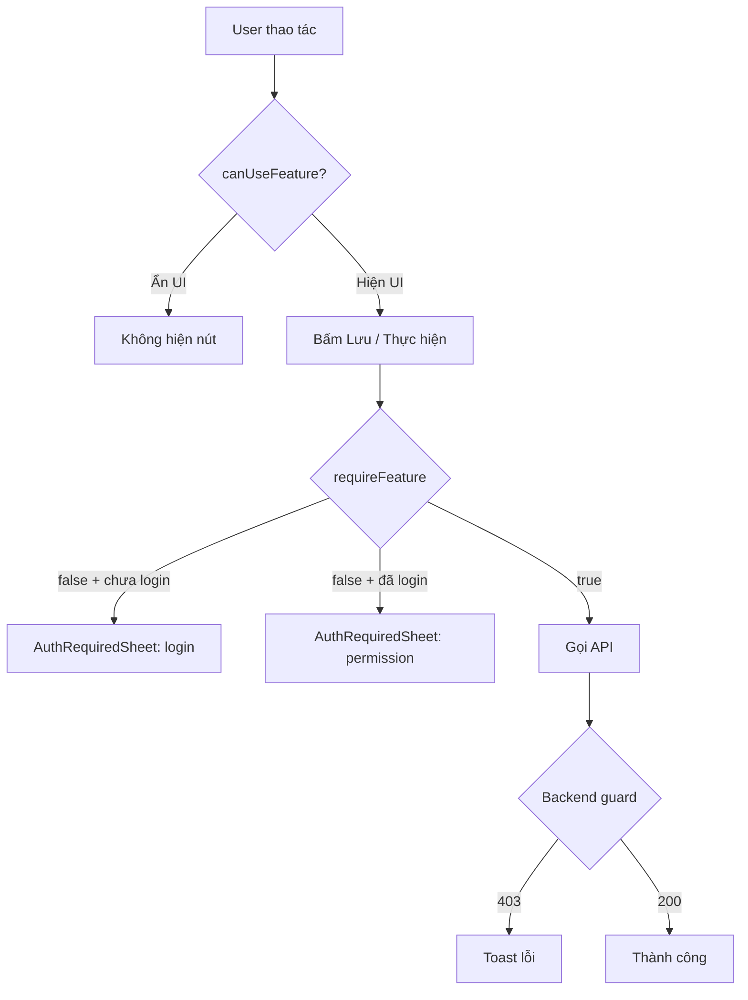

# Auth, Role & Permission — Quy tắc bắt buộc khi code

> **Mục đích:** Mọi thay đổi liên quan đăng nhập, phân quyền, hoặc chặn/mở chức năng **phải tuân theo tài liệu này**. Không tự ý invent guard/hook/check riêng từng page.
>
> **Đối tượng:** Developer, Cursor, Claude Code, và mọi AI agent làm việc trên repo.

Tài liệu setup tài khoản seed/env: [`auth-roles-setup.md`](./auth-roles-setup.md).

---

## 1. Khái niệm (3 lớp)

| Lớp | Câu hỏi | Nguồn sự thật |
|-----|---------|----------------|
| **Auth** | Ai đang đăng nhập? | JWT + `GET /auth/me` |
| **Role** | Vai trò hệ thống (`SYSTEM` / `ADMIN` / `STANDARD`)? | Cột `User.role` |
| **Feature permission** | User STANDARD được dùng chức năng nào? | `AppConfig` (mặc định) + `Organization.standardFeatures` (ghi đè theo org) |

**Quan hệ:**

```
Khách (no JWT)
  → xem theo DEFAULT_STANDARD_FEATURES (xem: bật, sửa: tắt)

STANDARD + JWT
  → merge(system defaults, org overrides) từ GET /auth/me.features

ADMIN / SYSTEM
  → mọi feature = true (bypass)
  → canMutate = true (quản lý user/org + mọi thao tác ghi không cần check feature)
```

**Nguyên tắc bảo mật:** Frontend chỉ ẩn/hiện UI và hướng dẫn user. **Backend luôn enforce** bằng guard — không tin client.

---

## 2. Role

| Role | `canMutate` | Phạm vi |
|------|-------------|---------|
| **SYSTEM** | `true` | Mọi org, mọi user, cấu hình mặc định feature toàn hệ thống |
| **ADMIN** | `true` | Một org (`User.organizationId`), user STANDARD trong org đó, ghi đè feature org |
| **STANDARD** | `false` | Chỉ ghi DB khi feature tương ứng được bật |
| **Khách** | `false` | Chỉ xem; ghi → yêu cầu đăng nhập |

Social login (Facebook/Zalo) tạo user **STANDARD**.

### Màn admin (frontend)

| Route | Hook bảo vệ page | Role |
|-------|------------------|------|
| `/system` | `useSystemAccess()` | SYSTEM |
| `/org-users` | `useOrgAdminAccess()` | ADMIN |

**Quy tắc:** Page admin mới **bắt buộc** dùng một trong hai hook trên. Không tự `router.push` hay `if (user.role)` rải rác.

---

## 3. Feature keys (STANDARD permission)

Danh sách **duy nhất** — thêm key mới phải cập nhật **cả hai file** (giữ đồng bộ):

- Backend: `backend/src/standard-features/standard-features.types.ts`
- Frontend: `frontend/lib/auth/standard-features.ts`

| Key | Nhóm | Mô tả | Backend guard | Frontend gate |
|-----|------|-------|---------------|-----------------|
| `tree` | Xem | Cây gia phả, căn giữa | — (GET public) | `TreeFab`, view tree |
| `book` | Xem | Sổ gia phả | — | Mở sổ |
| `events` | Xem | Danh sách sự kiện | — | Mở events |
| `export` | Xem | Xuất ảnh / preset | `PUT /export-preset` → `export` | Mở export |
| `search` | Xem | Tìm người | — | FAB search |
| `editTree` | Sửa | Thêm/sửa/xóa person & relationship | `FeatureMutateGuard` + `editTree` | `requireFeature('editTree')` |
| `editBook` | Sửa | Sửa trang/kiểu sổ | — (local/book UI) | `requireFeature('editBook')` |
| `editEvents` | Sửa | CRUD sự kiện, đóng góp, công đức | `FeatureMutateGuard` + `editEvents` | `requireFeature('editEvents')` |
| `linkAccount` | Sửa | Liên kết user ↔ person | `AuthService.linkPerson` | `requireFeature('linkAccount')` |
| `settings` | Sửa | Lưu cài đặt hiển thị user | `PUT /settings` → `settings` | `requireFeature('settings')` |

**Mặc định STANDARD** (`DEFAULT_STANDARD_FEATURES`): xem = `true`, sửa = `false` (trừ `linkAccount`, `settings` = `true`).

**Cấu hình:**

- SYSTEM: `/system` → tab **Quyền** → mặc định toàn hệ thống hoặc theo tổ chức
- ADMIN: `/org-users` → tab **Quyền**

API:

- `GET/PATCH /standard-features/defaults` — `SystemGuard`
- `GET/PATCH /organizations/:id/standard-features` — `MutateGuard` + org scope

---

## 4. Backend — chọn guard đúng

```
                    ┌─────────────────┐
                    │  JwtOptional    │  GET đọc công khai (vd. /auth/me, /person/root/tree)
                    └─────────────────┘

                    ┌─────────────────┐
                    │ JwtRequiredGuard│  Đã login, không cần role đặc biệt (hiếm)
                    └─────────────────┘

                    ┌─────────────────┐
                    │ FeatureMutate   │  Ghi dữ liệu nghiệp vụ — STANDARD được nếu feature bật
                    │ + @RequireFeature│  ADMIN/SYSTEM bypass
                    └─────────────────┘

                    ┌─────────────────┐
                    │  MutateGuard    │  Chỉ ADMIN / SYSTEM (users, org admin, feature config)
                    └─────────────────┘

                    ┌─────────────────┐
                    │  SystemGuard    │  Chỉ SYSTEM
                    └─────────────────┘
```

### Helper (`backend/src/auth/org-access.ts`)

| Hàm | Dùng khi |
|-----|----------|
| `canMutate(user)` | ADMIN hoặc SYSTEM |
| `isSystem(user)` | SYSTEM |
| `assertOrgAccess(user, orgId)` | Service — ADMIN chỉ org mình |
| `adminOrganizationId(user)` | Lấy orgId của ADMIN |

### Thêm endpoint ghi mới — checklist

1. Xác định feature key (hoặc `MutateGuard` nếu chỉ admin quản trị).
2. Controller:
   ```typescript
   @UseGuards(FeatureMutateGuard)
   @RequireFeature('editTree')  // import từ standard-features/require-feature.decorator
   @Post()
   ```
3. Module import `StandardFeaturesModule` (export `FeatureMutateGuard`).
4. Service: `assertOrgAccess` khi thao tác theo `organizationId`.
5. **Không** dùng `MutateGuard` cho API nghiệp vụ mà STANDARD có thể được cấp quyền.

### Endpoint chỉ admin/system (`MutateGuard`)

- `/users/*`
- `PATCH /organizations/:id` (đổi tên org)
- `GET /organizations` (list cho admin)
- `GET/PATCH .../standard-features` (cấu hình quyền)

### Endpoint chỉ SYSTEM (`SystemGuard`)

- `POST/DELETE /organizations`
- `GET/PATCH /standard-features/defaults`

---

## 5. Frontend — một cách kiểm tra duy nhất

### Nguồn state

| File | Trách nhiệm |
|------|-------------|
| `store/authStore.ts` | `user`, `features`, `canMutate`, `canUseFeature(key)` |
| `hooks/useFeatureAccess.ts` | **`requireFeature`**, `requireAdmin`, re-export flags |
| `store/authGateStore.ts` | Mở sheet: `login` \| `admin` \| `permission` |
| `components/auth/AuthRequiredSheet.tsx` | UI thông báo — **không** copy message riêng |

### Quy tắc UI

```typescript
import { useFeatureAccess } from '@/hooks/useFeatureAccess';

const { canUseFeature, requireFeature, requireAdmin } = useFeatureAccess();
```

| Tình huống | Dùng gì | Ví dụ |
|------------|---------|-------|
| Ẩn nút / menu / FAB | `canUseFeature('editTree')` | `TreeFab`, `PersonDetailFooter` |
| Trước khi gọi API ghi | `if (!requireFeature('editTree')) return` | `handleSave`, `handleDelete` |
| Chỉ ADMIN/SYSTEM (quản trị user) | `requireAdmin()` | Không dùng cho sửa gia phả thông thường |
| Pass xuống graph/sheet | `assertCanMutate={() => requireFeature('editTree')}` | `FamilyTreeGraph` |

**Không được:**

- `if (user?.role === 'ADMIN')` rải rác trong component nghiệp vụ
- Tự hiện `alert` / `window.confirm` thay `AuthRequiredSheet`
- Hard-code “cần quyền admin” khi thiếu feature — dùng gate `permission`
- Gọi API ghi mà không `requireFeature` tương ứng

### Map feature → UI (tham chiếu)

| Khu vực | Feature |
|---------|---------|
| `TreeFab` — từng action | `editTree`, `search`, `book`, `events`, `export`, `tree` |
| Person sheets (sửa/xóa/thêm) | `editTree` |
| `GenealogyBookViewer` — sửa trang/kiểu | `editBook` |
| `EventsManager` + contribution/donation | `editEvents` |
| `FamilyTreeSettings` — Lưu | `settings` |
| `UserAccountSheet` — liên kết person | `linkAccount` |

### Thêm chức năng mới — checklist frontend

1. Thêm key vào `frontend/lib/auth/standard-features.ts` (+ `FEATURE_LABELS`, `FEATURE_GROUPS`).
2. Đồng bộ backend `standard-features.types.ts`.
3. `canUseFeature` cho visibility; `requireFeature` trước mutation.
4. Chuỗi UI mới → `ui-strings.ts` (`UI.*`), không hard-code.
5. Nếu cần cấu hình bật/tắt: toggle tự xuất hiện trong `StandardFeaturesSection`.

---

## 6. Luồng người dùng (tóm tắt)



---

## 7. File tham chiếu (single source of truth)

### Backend

```
backend/src/auth/
  org-access.ts          # canMutate, assertOrgAccess
  mutate.guard.ts        # ADMIN | SYSTEM
  system.guard.ts        # SYSTEM only
  jwt-optional.guard.ts
  jwt-required.guard.ts

backend/src/standard-features/
  standard-features.types.ts   # keys, defaults, merge
  standard-features.service.ts # resolveForUser, config CRUD
  feature-mutate.guard.ts      # STANDARD + feature
  require-feature.decorator.ts # @RequireFeature('key')
  standard-features.controller.ts
```

### Frontend

```
frontend/store/authStore.ts
frontend/store/authGateStore.ts
frontend/hooks/useFeatureAccess.ts
frontend/hooks/useSystemAccess.ts
frontend/hooks/useOrgAdminAccess.ts
frontend/lib/auth/standard-features.ts
frontend/components/auth/AuthRequiredSheet.tsx
frontend/components/system/StandardFeaturesSection.tsx
```

---

## 8. Anti-patterns (cấm)

| ❌ Sai | ✅ Đúng |
|--------|---------|
| Mỗi page một hook `useCanEditX` | `useFeatureAccess` + key |
| Chỉ ẩn nút, không guard API | Cả UI + `FeatureMutateGuard` |
| `MutateGuard` trên POST person | `FeatureMutateGuard` + `editTree` |
| Check role trong 10 component | `canUseFeature` / `requireFeature` |
| Thêm quyền mà không cập nhật 2 file feature types | Luôn sync BE + FE keys |
| Page admin không dùng access hook | `useSystemAccess` / `useOrgAdminAccess` |

---

## 9. Kiểm tra trước khi merge

- [ ] Endpoint ghi mới có guard đúng lớp (Feature / Mutate / System)?
- [ ] Frontend: nút ẩn bằng `canUseFeature`, handler gọi `requireFeature`?
- [ ] Key feature đồng bộ backend + frontend?
- [ ] Chuỗi UI trong `ui-strings.ts`?
- [ ] STANDARD tắt feature → API trả 403, UI không crash?
- [ ] ADMIN/SYSTEM không bị chặn oan?

---

*Cập nhật lần cuối: theo implementation `standard-features` module. Khi đổi auth, sửa doc này trong cùng PR.*
