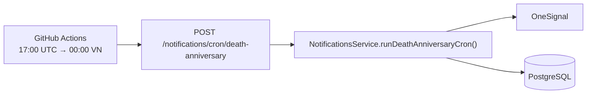

# Cron thông báo ngày giỗ — GitHub Actions

Job gửi push notification ngày giỗ chạy **mỗi ngày lúc 00:00 giờ Việt Nam** (đầu ngày — cấu hình `17:00 UTC` trong workflow). GitHub Actions có thể trễ vài phút đến vài giờ; chạy lúc 0h giúp job vẫn hoàn thành trong **sáng sớm cùng ngày** dương lịch tại VN.
**Miễn phí** trên GitHub (public repo không giới hạn; private repo có quota phút/tháng — job này ~vài giây/ngày).

Backend **không** cần process chạy 24/7 cho cron. Chỉ cần API public + endpoint HTTP.

## Kiến trúc



File workflow: [`.github/workflows/death-anniversary-cron.yml`](../.github/workflows/death-anniversary-cron.yml)

## Bước 1 — Backend env

Trên host backend (Railway, Render, Fly.io, VPS…), thêm vào `backend/.env` (production):

```env
CRON_SECRET=<chuỗi-ngẫu-nhiên-dài>
ENABLE_INTERNAL_CRON=false
ONESIGNAL_APP_ID=...
ONESIGNAL_REST_API_KEY=...
FRONTEND_URL=https://your-frontend.vercel.app
DATABASE_URL=...
```

| Biến | Ý nghĩa |
|------|---------|
| `CRON_SECRET` | Secret dùng chung với GitHub Actions (xem bước 2) |
| `ENABLE_INTERNAL_CRON=false` | Tắt `@nestjs/schedule` trong NestJS — tránh gửi trùng với GitHub Actions |
| `ENABLE_INTERNAL_CRON=true` | Chỉ dùng **local dev** — cron 00:00 ICT trong `pnpm start:dev` |

Tạo secret mạnh (ví dụ):

```bash
openssl rand -hex 32
```

Deploy lại backend sau khi đổi env.

> **Quan trọng:** `CRON_SECRET` phải có trên **cả hai** nơi — GitHub Secrets **và** env backend production. Chỉ cấu hình GitHub mà quên backend → HTTP 401 `"CRON_SECRET is not configured"`.

### Backend deploy trên Vercel

NestJS trên Vercel chạy **serverless** — `@nestjs/schedule` **không** chạy được; dùng GitHub Actions + endpoint HTTP (đúng với setup hiện tại).

1. [Vercel Dashboard](https://vercel.com/dashboard) → chọn **project backend** (khác project frontend nếu tách riêng).
2. **Settings** → **Environment Variables**.
3. Thêm (Production, và Preview nếu test trên preview URL):

   | Name | Value |
   |------|--------|
   | `CRON_SECRET` | Cùng chuỗi với GitHub Secret `CRON_SECRET` |
   | `ENABLE_INTERNAL_CRON` | `false` |
   | `DATABASE_URL` | … |
   | `ONESIGNAL_APP_ID` | … |
   | `ONESIGNAL_REST_API_KEY` | … |
   | `FRONTEND_URL` | URL frontend Vercel |
   | `JWT_SECRET` | … |

4. **Deployments** → deployment mới nhất → **⋯** → **Redeploy** (bắt buộc sau khi thêm env).
5. GitHub Secret `API_URL` = URL gốc backend Vercel, ví dụ `https://gia-pha-api.vercel.app` (không `/` cuối, không path `/api` trừ khi bạn cấu hình rewrite riêng).

Test:

```bash
curl -sS -X POST \
  -H "Authorization: Bearer YOUR_CRON_SECRET" \
  "https://YOUR-BACKEND.vercel.app/notifications/cron/death-anniversary"
```

Phải trả `200` và `{"sentCount":...}` — nếu vẫn `"CRON_SECRET is not configured"` → env chưa redeploy hoặc nhầm project Vercel.

## Bước 2 — GitHub repository secrets

1. Mở repo trên GitHub → **Settings** → **Secrets and variables** → **Actions**.
2. **New repository secret** — thêm **hai** secret:

| Secret name | Ví dụ giá trị | Ghi chú |
|-------------|---------------|---------|
| `API_URL` | `https://api.your-domain.com` | URL gốc backend, **không** có `/` cuối, **không** thêm path |
| `CRON_SECRET` | (cùng chuỗi với backend) | Phải **trùng** `CRON_SECRET` trên backend |

3. Push code có file `.github/workflows/death-anniversary-cron.yml` lên nhánh mặc định (`main` / `master`).

GitHub chỉ chạy workflow trên repo đã bật **Actions** (Settings → Actions → General → Allow all actions).

## Bước 3 — Kiểm tra workflow đã active

1. Tab **Actions** → chọn workflow **Death anniversary cron**.
2. Nếu chưa thấy lịch chạy: bấm **Run workflow** (nút **workflow_dispatch**) để test ngay.
3. Mở run vừa chạy → job **notify** → log phải có:
   - `POST https://.../notifications/cron/death-anniversary`
   - `HTTP 200`
   - Body JSON: `{"sentCount":0}` hoặc số lớn hơn nếu có người cần gửi.

## Bước 4 — Test bằng curl (không cần GitHub)

```bash
export API_URL=https://api.your-domain.com
export CRON_SECRET=your-secret

curl -sS -X POST \
  -H "Authorization: Bearer ${CRON_SECRET}" \
  -H "Content-Type: application/json" \
  "${API_URL%/}/notifications/cron/death-anniversary"
```

Kết quả: `{"sentCount": number}`.

## Lịch chạy

| Múi giờ | Giờ chạy (dự kiến) |
|---------|---------------------|
| Asia/Ho_Chi_Minh (UTC+7) | **00:00** mỗi ngày (đầu ngày) |
| UTC | **17:00** mỗi ngày |

Trong [death-anniversary-cron.yml](../.github/workflows/death-anniversary-cron.yml):

```yaml
schedule:
  - cron: '0 17 * * *'
```

GitHub chỉ hỗ trợ cron theo **UTC**; `0 17 * * *` = 00:00 giờ Việt Nam. Scheduled run có thể **trễ** (đặc biệt repo free/private) — đó là lý do chọn 0h thay vì 7h sáng.

Test nhanh không cần đợi schedule: **Actions → Death anniversary cron → Run workflow**.

Muốn đổi giờ: cộng/trừ offset UTC+7. Ví dụ 06:00 VN = `0 23 * * *` UTC (ngày hôm trước).

## Frontend (Vercel)

Deploy frontend như bình thường — **không cần** Vercel Cron hay `CRON_SECRET` trên Vercel.

Env frontend tối thiểu:

```env
NEXT_PUBLIC_API_URL=https://api.your-domain.com
NEXT_PUBLIC_ONESIGNAL_APP_ID=...
```

Route tùy chọn `frontend/app/api/cron/death-anniversary/route.ts` chỉ để test thủ công qua frontend; production dùng GitHub Actions → backend trực tiếp.

## Troubleshooting

| Triệu chứng | Cách xử lý |
|-------------|------------|
| Workflow không xuất hiện | Push file `.github/workflows/...` lên default branch; bật Actions trong repo |
| `Missing GitHub secrets` | Thêm `API_URL` và `CRON_SECRET` trong Settings → Secrets |
| HTTP 401 + `"CRON_SECRET is not configured"` | **Backend** chưa set env `CRON_SECRET` — thêm trên Railway/Render/VPS rồi **redeploy** (GitHub secret alone không đủ) |
| HTTP 401 + `"Invalid cron authorization"` | `CRON_SECRET` backend ≠ GitHub Secrets — sửa cho khớp, redeploy backend |
| HTTP 502 / connection refused | `API_URL` sai hoặc backend không public |
| `sentCount: 0` mãi | Bình thường nếu không có giỗ trong 0–3 ngày tới; kiểm tra `deathLunarDay/Month`, user bật notification + subscription OneSignal |
| Gửi trùng 2 lần/ngày | Đặt `ENABLE_INTERNAL_CRON=false` trên production |
| Scheduled run trễ vài phút | GitHub free tier có thể delay schedule; chấp nhận được với job hàng ngày |

## Local development

Trong `backend/.env`:

```env
ENABLE_INTERNAL_CRON=true
CRON_SECRET=dev-cron-secret
```

Cron NestJS chạy 00:00 ICT trong process `pnpm start:dev` (`NotificationScheduler`).

Hoặc gọi endpoint local:

```bash
curl -X POST -H "Authorization: Bearer dev-cron-secret" \
  http://localhost:5000/notifications/cron/death-anniversary
```

## Tài liệu liên quan

- [ONESIGNAL_SETUP.md](./ONESIGNAL_SETUP.md) — OneSignal + deploy tổng quan
- [notification-api.md](./notification-api.md) — API cron endpoint
- [notification-architecture.md](./notification-architecture.md) — kiến trúc hệ thống
