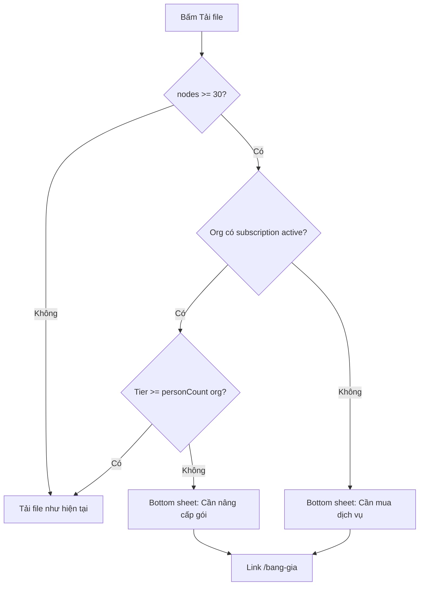
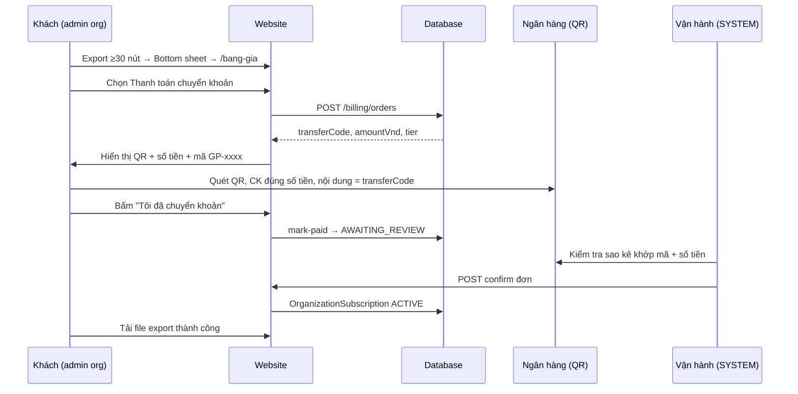
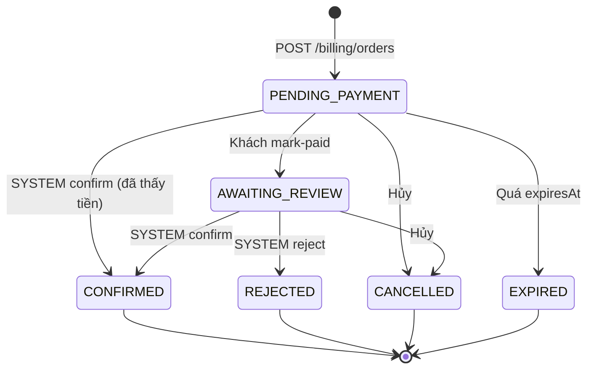

# Thiết kế tính phí — Tải file export gia phả

> **Trạng thái:** Đã triển khai MVP (QR thủ công + duyệt SYSTEM)  
> **Thanh toán MVP:** Chuyển khoản quét **QR tĩnh** + **kích hoạt thủ công** bởi vận hành (xem mục 9–10).  
> **Liên quan:** Export cây (`TreeExportView`), phân quyền [`auth-roles-permissions.md`](./auth-roles-permissions.md), landing dịch vụ

---

## 1. Mục tiêu

- Cho phép dùng **gia phả điện tử miễn phí** (xem sổ, cây, chỉnh layout export trên màn hình).
- **Thu phí** khi người dùng muốn **tải file** (SVG/PNG/PDF) từ màn export, với cây từ **30 nút (person) trở lên**.
- Bán **gói theo dòng họ (Organization)** theo **quy mô** (số thành viên, dung lượng ảnh, số quản trị), thời hạn **1 năm**.
- Hướng tới thị trường Việt Nam: giá VND, trang bảng giá công khai.
- **MVP thanh toán:** Khách quét **QR chuyển khoản** của bạn → hệ thống lưu **đơn thanh toán** → bạn **xác nhận & kích hoạt gói thủ công** trong admin.

---

## 2. Nguyên tắc sản phẩm

| Hành vi | Miễn phí | Có gói trả phí (còn hạn) |
|--------|----------|---------------------------|
| Xem sổ / cây gia phả | ✅ | ✅ |
| Mở màn **Export**, chỉnh khung, câu đối, màu | ✅ | ✅ |
| **Tải file** export | ✅ nếu **&lt; 30** nút trong lần export | ✅ nếu **≥ 30** nút **và** gói org đủ hạn mức |
| Thêm/sửa thành viên (theo quyền hiện tại) | Theo `canMutate` / feature flags | Chịu **hạn mức người** của gói (mục 3) |
| Upload ảnh thành viên / sự kiện | Theo quota hiện tại (nếu có) | Chịu **hạn mức dung lượng** của gói |
| Mời thêm quản trị viên | Theo quyền hiện tại | Chịu **hạn mức admin** của gói |

**Tách bạch các khái niệm:**

1. **Ngưỡng export (30 nút)** — kích hoạt **yêu cầu gói trả phí** để tải file.
2. **Hạng gói (4 mức)** — quyết định **giá** và **hạn mức** (người, ảnh, admin) theo **tổng số Person** của Organization tại thời điểm mua / gia hạn.

Ví dụ: Dòng họ có 120 người, export 45 người (sau lọc nhánh) → ≥ 30 nút → cần gói; vì 50 &lt; 120 ≤ 300 → gói **Dòng họ Nhỏ — 500.000 ₫/năm**.

---

## 3. Bảng giá & hạn mức gói

Giá **theo Organization / năm** (VNĐ). Hạng **bắt buộc** được chọn theo `COUNT(Person WHERE organizationId = ?)` tại thời điểm **mua hoặc gia hạn** — phải là gói **nhỏ nhất** còn chứa đủ số người hiện tại.

| | 🟢 **Gia đình** | 🔵 **Dòng họ Nhỏ** | 🟠 **Dòng họ Trung bình** | 🔴 **Dòng họ Lớn** |
|---|:---:|:---:|:---:|:---:|
| **Giá / năm** | **100.000 ₫** | **500.000 ₫** | **1.000.000 ₫** | **2.000.000 ₫** |
| **Tối đa thành viên** | 50 | 300 | 1.000 | 3.000 |
| **Dung lượng ảnh** | 1 GB | 10 GB | 30 GB | 100 GB |
| **Quản trị viên** | 1 | 5 | 10 | Không giới hạn |

**Mã nội bộ (enum):** `FAMILY` · `SMALL` · `MEDIUM` · `LARGE`

**Quy tắc chọn hạng khi thanh toán:**

```
personCount = số Person trong org
if personCount <= 50   → FAMILY  (100_000)
else if personCount <= 300  → SMALL   (500_000)
else if personCount <= 1000 → MEDIUM  (1_000_000)
else if personCount <= 3000 → LARGE   (2_000_000)
else → không tự phục vụ; liên hệ báo giá riêng (enterprise)
```

**Gia hạn:** Mua lại cùng logic; nếu org đã tăng người vượt hạng cũ → lần gia hạn phải **nâng hạng** (hoặc chặn export / thêm người cho đến khi nâng cấp — xem mục 8).

### 3.1 Hạn mức kèm gói (entitlements)

Mỗi hạng gắn bộ hạn mức cố định; lưu snapshot trên subscription để audit, logic đọc từ **catalog tier** trong code / `AppConfig`.

| Hạng | `maxPersons` | `storageQuotaGb` | `maxAdmins` |
|------|-------------|------------------|-------------|
| `FAMILY` | 50 | 1 | 1 |
| `SMALL` | 300 | 10 | 5 |
| `MEDIUM` | 1_000 | 30 | 10 |
| `LARGE` | 3_000 | 100 | `null` (không giới hạn) |

**Áp dụng khi có gói ACTIVE:**

- **Thêm Person:** từ chối nếu `personCount >= maxPersons` (trừ SYSTEM bypass).
- **Upload ảnh:** từ chối nếu `storageUsedBytes + fileSize > storageQuotaGb` (tính tổng file org).
- **Gán role ADMIN org:** từ chối nếu `adminCount >= maxAdmins` (`maxAdmins = null` → bỏ qua).

**Miễn phí (chưa có gói):** vẫn xem sổ / cây / export UI; hạn mức người & ảnh có thể giữ ngưỡng thấp riêng hoặc chỉ enforce sau khi trả phí — quyết định product khi triển khai.

---

## 4. Luồng UX — Export & Bottom sheet

### 4.1 Điểm chặn

- File: `frontend/components/family-tree/export/useTreeExport.ts` → `handleExport()`.
- Hiện tại: chỉ kiểm tra `canDownloadExport` (= `canMutate`, admin mới tải).
- **Mới:** Tách quyền **“tải file export”** khỏi `canMutate`:
  - **Admin / demo:** giữ hành vi hiện tại hoặc exempt (cấu hình).
  - **User thường / khách có org token:** luôn mở được export UI; khi bấm **Tải về** mới kiểm tra billing.

### 4.2 Đếm nút

- Dùng `exportModel.nodes.length` (số person có mặt trong **ảnh export hiện tại**, sau lọc nhánh/đời).
- Không dùng tổng org nếu user export subset nhỏ (&lt; 30 nút) → vẫn tải miễn phí dù org 2.000 người (cho phép in thử một nhánh).

### 4.3 Luồng khi bấm Download



### 4.4 Nội dung Bottom sheet (gợi ý copy UI)

**Tiêu đề:** `Cần gói dịch vụ để tải file`

**Nội dung:**

- Bạn đang export **{n}** thành viên (từ 30 trở lên cần gói trả phí).
- Bạn vẫn dùng **gia phả điện tử** và chỉnh sơ đồ trên web **miễn phí**.
- Để **tải ảnh / file in**, vui lòng mua gói theo quy mô dòng họ.

**Nút:**

- **Xem bảng giá** → `/bang-gia` (hoặc `/bang-gia?orgId=…`)
- **Đóng** — ở lại màn export

Chuỗi đặt trong `frontend/lib/constants/ui-strings/` (module `billing.ts` hoặc `public.ts`).

### 4.5 Trang bảng giá `/bang-gia`

- Server hoặc client page công khai, đồng bộ với landing **Dịch vụ của chúng tôi**.
- Hiển thị **4 hạng** (bảng mục 3) kèm icon màu 🟢🔵🟠🔴, FAQ ngắn:
  - Tính theo số người **trong hệ thống**, không phải số người trên một ảnh export.
  - Export &lt; 30 người: tải miễn phí.
  - Thời hạn 12 tháng kể từ ngày thanh toán thành công.
- CTA: **Thanh toán chuyển khoản** → `/bang-gia/thanh-toan?orgId=…` (xem mục 9).

---

## 5. Mô hình dữ liệu (Prisma)

### 5.1 Enum

```prisma
enum SubscriptionTier {
  FAMILY   // Gia đình — <= 50 persons
  SMALL    // Dòng họ Nhỏ — <= 300
  MEDIUM   // Dòng họ Trung bình — <= 1000
  LARGE    // Dòng họ Lớn — <= 3000
}

enum SubscriptionStatus {
  PENDING    // đơn đã tạo, chờ chuyển khoản / chờ duyệt
  ACTIVE
  EXPIRED
  CANCELLED
}

enum BillingOrderStatus {
  PENDING_PAYMENT   // khách đã tạo đơn, chưa báo đã chuyển
  AWAITING_REVIEW   // khách bấm "Tôi đã chuyển khoản"
  CONFIRMED         // vận hành xác nhận tiền → đã kích hoạt gói
  REJECTED          // sai số tiền / không khớp
  CANCELLED         // khách hoặc admin hủy
  EXPIRED           // quá hạn thanh toán (vd. 7 ngày)
}
```

### 5.2 Bảng `BillingOrder` (đơn thanh toán — lưu trước khi kích hoạt)

Mỗi lần khách muốn mua / gia hạn tạo **một đơn** với mã tham chiếu chuyển khoản duy nhất.

| Cột | Kiểu | Ghi chú |
|-----|------|---------|
| `id` | Int | PK |
| `organizationId` | Int | FK Organization |
| `transferCode` | String @unique | Mã nội dung CK, vd. `GP-42-A7K9` |
| `tier` | SubscriptionTier | Hạng tính theo personCount lúc tạo đơn |
| `personCountAtOrder` | Int | Snapshot |
| `amountVnd` | Int | 100_000 / 500_000 / 1_000_000 / 2_000_000 |
| `status` | BillingOrderStatus | |
| `contactName` | String? | Người liên hệ |
| `contactPhone` | String? | SĐT / Zalo |
| `contactEmail` | String? | |
| `note` | String? | Ghi chú khách |
| `paidAt` | DateTime? | Khách báo đã CK hoặc admin ghi |
| `reviewedAt` | DateTime? | Lúc admin xử lý |
| `reviewedByUserId` | Int? | FK User (SYSTEM) |
| `reviewNote` | String? | Lý do từ chối / ghi chú nội bộ |
| `expiresAt` | DateTime | Hết hạn đơn (vd. +7 ngày) |
| `createdAt` | DateTime | |

**`transferCode`:** 8–12 ký tự, dễ đọc (không O/0, I/1). Khách **bắt buộc** ghi đúng vào nội dung chuyển khoản để bạn đối soát trên app ngân hàng.

### 5.3 Bảng `OrganizationSubscription`

| Cột | Kiểu | Ghi chú |
|-----|------|---------|
| `id` | Int | PK |
| `organizationId` | Int | FK Organization |
| `tier` | SubscriptionTier | Hạng đã mua |
| `personCountAtPurchase` | Int | Snapshot khi mua (audit) |
| `status` | SubscriptionStatus | |
| `startsAt` | DateTime | |
| `expiresAt` | DateTime | +1 năm |
| `amountVnd` | Int | 100_000 / 500_000 / 1_000_000 / 2_000_000 |
| `billingOrderId` | Int? @unique | FK đơn đã xác nhận (audit) |
| `paymentRef` | String? | Mã GD ngân hàng (admin nhập khi duyệt) |
| `activatedByUserId` | Int? | User SYSTEM kích hoạt |
| `createdAt` | DateTime | |

- Một org có **nhiều bản ghi** lịch sử; **active** = `status = ACTIVE AND expiresAt > now()` (lấy bản mới nhất).
- **Chỉ tạo `OrganizationSubscription` khi admin `CONFIRM` đơn** — không tạo sẵn khi khách mới tạo đơn.
- Có thể thêm `Organization.subscriptionExpiresAt` denormalized để query nhanh (tùy chọn).

### 5.4 Cấu hình QR & tài khoản (`AppConfig` hoặc env)

| Key | Ví dụ | Mô tả |
|-----|-------|--------|
| `billing.qrImageUrl` | `/images/payment-qr.png` hoặc URL CDN | Ảnh QR bạn cung cấp |
| `billing.accountName` | `NGUYEN VAN A` | Chủ tài khoản (hiển thị) |
| `billing.accountNumber` | `1234567890` | Số TK |
| `billing.bankName` | `Vietcombank` | Tên ngân hàng |
| `billing.orderExpireDays` | `7` | Đơn hết hạn sau N ngày |

Frontend public: `NEXT_PUBLIC_PAYMENT_QR_URL` (ảnh QR tĩnh trong `frontend/public/`).

### 5.5 Helper tier & entitlements

```typescript
const TIER_CATALOG: Record<
  SubscriptionTier,
  { label: string; maxPersons: number; storageQuotaGb: number; maxAdmins: number | null; priceVnd: number }
> = {
  FAMILY: { label: 'Gia đình', maxPersons: 50, storageQuotaGb: 1, maxAdmins: 1, priceVnd: 100_000 },
  SMALL:  { label: 'Dòng họ Nhỏ', maxPersons: 300, storageQuotaGb: 10, maxAdmins: 5, priceVnd: 500_000 },
  MEDIUM: { label: 'Dòng họ Trung bình', maxPersons: 1_000, storageQuotaGb: 30, maxAdmins: 10, priceVnd: 1_000_000 },
  LARGE:  { label: 'Dòng họ Lớn', maxPersons: 3_000, storageQuotaGb: 100, maxAdmins: null, priceVnd: 2_000_000 },
};

function tierForPersonCount(count: number): SubscriptionTier | null {
  if (count <= 50) return 'FAMILY';
  if (count <= 300) return 'SMALL';
  if (count <= 1_000) return 'MEDIUM';
  if (count <= 3_000) return 'LARGE';
  return null; // > 3000 → liên hệ enterprise
}

function tierRank(tier: SubscriptionTier): number {
  return { FAMILY: 1, SMALL: 2, MEDIUM: 3, LARGE: 4 }[tier];
}

function priceVndForTier(tier: SubscriptionTier): number {
  return TIER_CATALOG[tier].priceVnd;
}
```

---

## 6. API Backend (NestJS)

### 6.0 Billing / đơn thanh toán (MVP QR)

| Method | Path | Quyền | Mô tả |
|--------|------|-------|--------|
| `GET` | `/billing/config` | Public | QR URL, tên TK, ngân hàng (không secret) |
| `POST` | `/billing/orders` | Org admin hoặc JWT + `organizationId` | Tạo đơn `PENDING_PAYMENT`, trả `transferCode`, `amountVnd`, `tier` |
| `GET` | `/billing/orders/:transferCode` | Public (mã đơn) | Khách tra trạng thái đơn |
| `POST` | `/billing/orders/:id/mark-paid` | Org admin | Khách bấm "Đã chuyển khoản" → `AWAITING_REVIEW` |
| `GET` | `/billing/orders` | SYSTEM | Danh sách đơn lọc theo `status` |
| `POST` | `/billing/orders/:id/confirm` | SYSTEM | Xác nhận tiền → tạo `OrganizationSubscription` ACTIVE + `CONFIRMED` |
| `POST` | `/billing/orders/:id/reject` | SYSTEM | `REJECTED` + `reviewNote` |

| Method | Path | Mô tả |
|--------|------|--------|
| `GET` | `/organizations/:id/subscription` | Trạng thái gói (admin org hoặc system) |
| `GET` | `/organizations/:id/export-download-eligibility` | `{ allowed, reason, nodeCount?, requiredTier?, expiresAt? }` |

*(Phase sau)* `POST /organizations/:id/subscription/checkout`, webhook cổng TT.

### 6.1 `POST /billing/orders` — tạo đơn

**Body:** `{ organizationId, contactName?, contactPhone?, contactEmail?, note? }`

**Server:**

1. Đếm `personCount` trong org.
2. `tier = tierForPersonCount(personCount)` — nếu `null` ( &gt; 3.000 người) → `400` + hướng liên hệ.
3. `amountVnd = priceVndForTier(tier)`.
3. Sinh `transferCode` unique.
4. Insert `BillingOrder` status `PENDING_PAYMENT`, `expiresAt = now + 7 days`.
5. Trả về: `{ orderId, transferCode, tier, amountVnd, personCount, expiresAt, bankDisplay }`.

**Ràng buộc:** Nếu đã có đơn `PENDING_PAYMENT` / `AWAITING_REVIEW` cho cùng org → trả đơn cũ (idempotent) thay vì tạo trùng.

### 6.2 `POST /billing/orders/:id/confirm` — kích hoạt thủ công (SYSTEM)

**Body:** `{ paymentRef?, reviewNote? }` — `paymentRef` = mã giao dịch ngân hàng (tuỳ chọn).

**Server (transaction):**

1. Kiểm tra đơn `AWAITING_REVIEW` hoặc cho phép confirm từ `PENDING_PAYMENT` (admin thấy tiền rồi).
2. `startsAt = now()`, `expiresAt = now() + 1 year`.
3. Tạo `OrganizationSubscription` `ACTIVE`, link `billingOrderId`.
4. Cập nhật đơn → `CONFIRMED`, `reviewedAt`, `reviewedByUserId`.
5. *(Tuỳ chọn)* Gửi email/Zalo thông báo cho `contactEmail` / admin org.

**Gia hạn:** Nếu org đã có subscription ACTIVE, `confirm` có thể **cộng dồn** 1 năm từ `max(now, expiresAt)` thay vì ghi đè.

### 6.3 `export-download-eligibility`

**Input (query):** `nodeCount` (số nút export client gửi lên).

**Logic:**

```
if nodeCount < 30 → { allowed: true }

personCount = count persons in org
requiredTier = tierForPersonCount(personCount)
sub = active subscription for org

if !sub → { allowed: false, reason: 'NO_SUBSCRIPTION', requiredTier }
if tierRank(sub.tier) < tierRank(requiredTier) → { allowed: false, reason: 'TIER_TOO_LOW', requiredTier }
if sub.expiresAt < now → { allowed: false, reason: 'EXPIRED' }

return { allowed: true }
```

**Bảo mật:** Frontend **không** là nguồn sự thật — endpoint này dùng cho UI; nếu sau này có API tải file phía server thì **bắt buộc** kiểm tra lại.

### 6.4 Guard tương lai

- Không chặn `GET /person/*` (xem).
- Có thể thêm header audit khi generate file server-side.

---

## 7. Frontend — thay đổi dự kiến

| File / vùng | Thay đổi |
|-------------|----------|
| `useTreeExport.ts` | Trước `downloadSvgElement`, gọi eligibility hoặc check local + confirm API |
| `ExportPaywallSheet.tsx` | Bottom sheet mới (dùng `BottomSheet` UI) |
| `app/bang-gia/page.tsx` | Trang giá |
| `app/bang-gia/thanh-toan/page.tsx` | QR + form đơn + trạng thái |
| `app/system/billing/page.tsx` | Admin duyệt đơn (SYSTEM) |
| `lib/api/modules/billing.ts` | Client API đơn & subscription |
| `useFeatureAccess` hoặc `useExportBilling.ts` | Hook gom logic |
| `family-tree/page.tsx` | `canDownloadExport` → tách: preview luôn; download qua billing |

**Ngưỡng 30:** hằng số `EXPORT_FREE_DOWNLOAD_MAX_NODES = 30` trong `frontend/lib/constants/billing.ts` (và mirror backend).

---

## 8. Edge cases & chính sách

| Tình huống | Đề xuất |
|------------|---------|
| Org 80 người, gói FAMILY (50) còn hạn | Chặn tải ≥30 nút; chặn thêm người; sheet gợi **nâng cấp** SMALL |
| Org 350 người, chỉ gói SMALL (300) | Chặn export ≥30 nút nếu tier thấp; gợi MEDIUM |
| Org tăng từ 40 → 120 người giữa kỳ (FAMILY) | Cho dùng đến `expiresAt`; gia hạn bắt mua SMALL |
| Org &gt; 3.000 người | Không tạo đơn tự động; CTA **Liên hệ báo giá** |
| Đã 5 admin, gói SMALL | Chặn mời admin thứ 6; gợi MEDIUM |
| Dung lượng ảnh vượt 10 GB, gói SMALL | Chặn upload; gợi nâng hạng |
| Export 25 người, org 5.000 người | Cho tải **miễn phí** (&lt; 30 nút) |
| Khách chỉ có org access token, chưa login | Xem bảng giá được; **tạo đơn** cần admin org đăng nhập |
| Đơn PENDING, khách chưa CK | Cron hoặc job đánh `EXPIRED` sau `expiresAt` |
| Hai đơn AWAITING_REVIEW cùng số tiền | Admin đối soát thêm `transferCode` / org / thời gian CK |
| Tài khoản `isDemo` | Không tải file ≥30 nút; hoặc exempt tùy product |
| `SYSTEM` / `ADMIN` | Có thể bypass billing trong môi trường nội bộ (`BILLING_ENFORCE=false`) |
| In từ trình duyệt (Print) | Phase 1: không chặn; Phase 2: cân nhắc watermark nếu chưa trả phí |

---

## 9. Thanh toán QR thủ công (MVP — phase hiện tại)

Bạn cung cấp **một ảnh QR** (VietQR / app ngân hàng). Khách quét và chuyển khoản; **không** tích hợp cổng thanh toán tự động. Hệ thống lưu đơn vào DB; **bạn (SYSTEM)** xác nhận và kích hoạt gói.

### 9.1 Tổng quan vai trò

| Vai trò | Việc làm |
|---------|----------|
| **Khách / Admin dòng họ** | Tạo đơn trên web → chuyển khoản đúng số tiền + **mã `transferCode`** → bấm "Đã chuyển khoản" |
| **Bạn (vận hành / SYSTEM)** | Xem app ngân hàng, đối soát mã CK → vào **Quản trị → Duyệt thanh toán** → **Xác nhận & kích hoạt** |
| **Hệ thống** | Lưu `BillingOrder`, khi confirm tạo `OrganizationSubscription` ACTIVE 1 năm |

### 9.2 Luồng khách hàng (end-to-end)



### 9.3 Màn hình `/bang-gia/thanh-toan`

**Đầu vào:** `?orgId=` (bắt buộc) — lấy từ JWT admin org hoặc org đang truy cập.

**Hiển thị:**

1. **Tóm tắt gói:** Tên dòng họ, số thành viên hiện tại, hạng, **số tiền / năm**.
2. **Ảnh QR** (`NEXT_PUBLIC_PAYMENT_QR_URL` hoặc `GET /billing/config`).
3. **Thông tin chuyển khoản:** Chủ TK, số TK, ngân hàng (copy được).
4. **Mã đơn `transferCode`** — nút copy, in đậm: *"Ghi đúng mã này vào nội dung chuyển khoản"*.
5. Form liên hệ (tên, SĐT, email) — lưu vào `BillingOrder`.
6. Nút **Tôi đã chuyển khoản** → `AWAITING_REVIEW`.
7. Trạng thái đơn: *Chờ chuyển khoản* / *Chờ xác nhận* / *Đã kích hoạt đến …*.

**Lưu ý UX:**

- Số tiền hiển thị **định dạng VN** (vd. 100.000 ₫, 2.000.000 ₫).
- Cảnh báo: Chuyển **đúng số tiền**; sai số tiền có thể chậm xử lý.
- Thời gian xử lý: *"Trong giờ hành chính, thường trong 24h sau khi chuyển khoản"*.

### 9.4 Luồng vận hành — duyệt thủ công

**Trang:** `/system/billing` (chỉ `User.role = SYSTEM`).

**Danh sách đơn** (tab):

| Tab | `BillingOrderStatus` |
|-----|----------------------|
| Cần duyệt | `AWAITING_REVIEW` (ưu tiên), `PENDING_PAYMENT` |
| Đã xử lý | `CONFIRMED`, `REJECTED` |
| Tất cả | |

**Mỗi dòng hiển thị:** `transferCode`, org name, `amountVnd`, tier, personCount, contact, `createdAt`, status.

**Chi tiết đơn → hành động:**

| Nút | Kết quả |
|-----|---------|
| **Xác nhận & kích hoạt gói** | `CONFIRMED` + `OrganizationSubscription` ACTIVE 1 năm |
| **Từ chối** | `REJECTED` + nhập lý do (hiển thị cho khách khi tra đơn) |
| **Hủy đơn** | `CANCELLED` |

**Checklist khi xác nhận (ngoài app, không code):**

- [ ] Nội dung CK chứa đúng `transferCode`
- [ ] Số tiền khớp `amountVnd`
- [ ] Thời gian CK trong khoảng hợp lý sau `createdAt`
- [ ] Đúng dòng họ (`organizationId`)

**Sau khi confirm:** Khách refresh trang export hoặc mở lại eligibility → được tải file.

### 9.5 Sơ đồ trạng thái đơn



### 9.6 Đối soát khi không có mã trong nội dung CK

Khách quên ghi `transferCode` → admin tìm đơn theo **số tiền + thời gian + tên liên hệ** trong danh sách `AWAITING_REVIEW`, mở chi tiết và confirm thủ công; ghi `reviewNote` và `paymentRef` ngân hàng.

### 9.7 Bảo mật

- Không đặt thông tin nhạy cảm trong QR URL công khai ngoài ảnh QR chuẩn ngân hàng.
- `confirm` / `reject` **chỉ SYSTEM** — không cho ADMIN org tự kích hoạt (tránh gian lận).
- Org admin chỉ tạo đơn cho **org mình** (`organizationId` khớp JWT).

---

## 10. Thanh toán tự động (phase sau)

- Tích hợp **VNPay / MoMo / PayOS** thay QR tĩnh.
- Webhook → tự `CONFIRMED` + kích hoạt subscription (giữ nguyên bảng `BillingOrder` để audit).
- Email xác nhận (Resend — [`resend-setup.md`](./resend-setup.md)).

---

## 11. Cấu hình môi trường (dự kiến)

```env
# Backend
BILLING_ENFORCE=true
EXPORT_FREE_DOWNLOAD_MAX_NODES=30
BILLING_ORDER_EXPIRE_DAYS=7

# Frontend (public)
NEXT_PUBLIC_EXPORT_FREE_DOWNLOAD_MAX_NODES=30
NEXT_PUBLIC_BILLING_ENABLED=true
NEXT_PUBLIC_PAYMENT_QR_URL=/images/payment-qr.png

# Hiển thị trên trang thanh toán (optional — hoặc GET /billing/config)
NEXT_PUBLIC_PAYMENT_ACCOUNT_NAME=
NEXT_PUBLIC_PAYMENT_ACCOUNT_NUMBER=
NEXT_PUBLIC_PAYMENT_BANK_NAME=
```

**Ảnh QR:** đặt file tại `frontend/public/images/payment-qr.png` (hoặc URL CDN). Bạn tự export QR từ app ngân hàng / VietQR.

Giá có thể hard-code tier trong code phase 1; sau chuyển `AppConfig` JSON nếu cần đổi giá không deploy.

---

## 12. Lộ trình triển khai gợi ý

| Bước | Việc | Ước lượng |
|------|------|-----------|
| 1 | Doc + UI strings + `/bang-gia` tĩnh | 0.5 ngày |
| 2 | `ExportPaywallSheet` + check 30 nút | 1 ngày |
| 3 | Prisma: `BillingOrder` + `OrganizationSubscription` | 0.5 ngày |
| 4 | API billing orders + eligibility | 1 ngày |
| 5 | `/bang-gia/thanh-toan` (QR + tạo đơn + mark-paid) | 1 ngày |
| 6 | `/system/billing` duyệt confirm/reject | 1 ngày |
| 7 | Upload QR + cấu hình env production | 0.25 ngày |
| 8 | *(Sau)* Cổng thanh toán tự động | 2–3 ngày |

---

## 13. Kiểm thử chấp nhận

### Export & gói

- [ ] Export 29 nút → tải được không cần gói.
- [ ] Export 30 nút, org chưa trả phí → bottom sheet, không tải file.
- [ ] Sheet có link `/bang-gia` hoạt động.
- [ ] Org 40 người, gói FAMILY active → export 50 nút → tải được.
- [ ] Org 80 người, chỉ gói FAMILY → export 40 nút → sheet nâng cấp SMALL.
- [ ] Org 800 người, chỉ gói SMALL → export 40 nút → sheet nâng cấp MEDIUM.
- [ ] Hết hạn gói → sheet báo gia hạn.
- [ ] Vẫn xem sổ/cây và mở export khi chưa trả phí.

### Thanh toán QR thủ công

- [ ] Tạo đơn → hiện QR, `transferCode`, đúng `amountVnd` theo personCount.
- [ ] Copy mã CK hoạt động.
- [ ] `mark-paid` → trạng thái *Chờ xác nhận*.
- [ ] SYSTEM confirm → subscription ACTIVE, `expiresAt` +1 năm.
- [ ] Sau confirm, export ≥30 nút tải được.
- [ ] SYSTEM reject → khách tra đơn thấy lý do.
- [ ] Đơn quá hạn → `EXPIRED`, phải tạo đơn mới.
- [ ] Không tạo trùng nhiều đơn PENDING cho cùng org (idempotent).

---

## 14. Tóm tắt một dòng

**&lt; 30 nút export: tải miễn phí; ≥ 30 nút: cần gói ACTIVE đủ hạng. Bốn gói: Gia đình 100k · Nhỏ 500k · Trung bình 1M · Lớn 2M VND/năm (50 / 300 / 1.000 / 3.000 người; kèm hạn mức ảnh & admin). MVP: CK QR + duyệt thủ công.**
