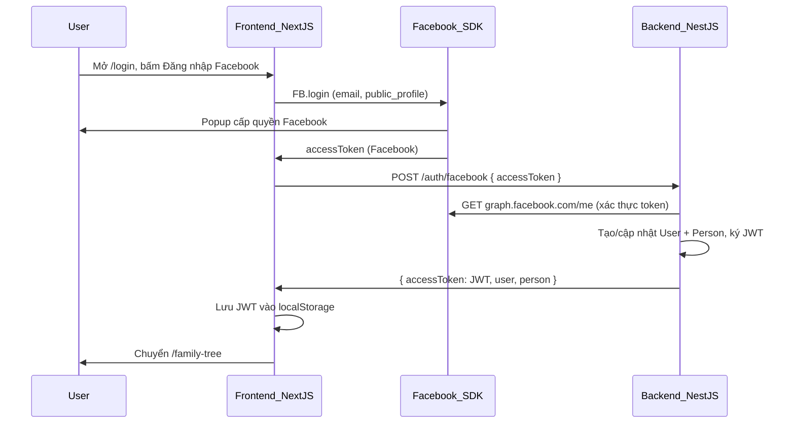

# Đăng nhập bằng Facebook — Hướng dẫn setup

Tài liệu này mô tả cách cấu hình và chạy **đăng nhập Facebook** cho dự án Gia phả.

> **Zalo login** tạm ẩn trên UI (cần backend tại Việt Nam). Bật lại bằng `NEXT_PUBLIC_ENABLE_ZALO_LOGIN=true` — xem [`zalo-login-setup.md`](zalo-login-setup.md).

## Tổng quan luồng



Backend **không cần** Facebook App Secret cho flow này — chỉ xác minh token qua Graph API. App Secret chỉ cần nếu sau này làm server-side OAuth.

---

## Link tài liệu chính thức

| Mục | Link |
|-----|------|
| Meta for Developers | https://developers.facebook.com/ |
| Tạo app | https://developers.facebook.com/apps/ |
| Facebook Login — Web | https://developers.facebook.com/docs/facebook-login/web |
| JavaScript SDK | https://developers.facebook.com/docs/javascript |
| Graph API User | https://developers.facebook.com/docs/graph-api/reference/user |

### Endpoint dùng trong code

| Bước | Method | URL |
|------|--------|-----|
| Login (frontend) | FB SDK | `FB.login` |
| Xác thực + profile (backend) | GET | `https://graph.facebook.com/me?fields=id,name,email,picture` |
| Đổi token app (backend) | POST | `/auth/facebook` |

---

## Bước 1 — Tạo Facebook App

1. Vào https://developers.facebook.com/apps/ → **Create App**.
2. Chọn use case phù hợp (ví dụ **Authenticate and request data from users** / Consumer).
3. Điền tên app, email liên hệ.
4. Trong app dashboard, thêm sản phẩm **Facebook Login** → chọn **Web**.
5. Lấy **App ID** (dùng cho frontend `NEXT_PUBLIC_FACEBOOK_APP_ID`).

### Cấu hình Facebook Login (Web)

Vào **Facebook Login → Settings**:

| Mục | Giá trị dev |
|-----|-------------|
| Valid OAuth Redirect URIs | `http://localhost:3000/` (và `http://localhost:3000/login` nếu Meta yêu cầu) |
| Client OAuth Login | Yes |
| Web OAuth Login | Yes |

Vào **Settings → Basic**:

| Mục | Ghi chú |
|-----|---------|
| App Domains | `localhost` (dev) |
| Privacy Policy URL | Bắt buộc khi public/live — có thể dùng URL tạm khi dev |
| Add Platform → Website | Site URL: `http://localhost:3000` |

### Chế độ app (Development vs Live)

- **Development:** chỉ tài khoản được thêm làm **Tester/Developer/Admin** trong app mới login được.
- **Live:** cần hoàn tất App Review cho quyền `email`, `public_profile` nếu dùng với user bên ngoài.

Thêm tester: **App Roles → Roles → Add Testers** (nhập Facebook username/email).

---

## Bước 2 — Biến môi trường

### Backend (`backend/.env`)

```env
DATABASE_URL=postgresql://...
JWT_SECRET=<chuoi-bi-mat-manh>
PORT=5000

# Bắt buộc đăng nhập trước khi vào app
ALLOW_PUBLIC_ACCESS=false
```

Backend **không** cần biến Facebook riêng cho flow hiện tại.

### Frontend (`frontend/.env.local`)

```env
NEXT_PUBLIC_API_URL=http://localhost:5000
NEXT_PUBLIC_ALLOW_PUBLIC_ACCESS=false
NEXT_PUBLIC_FACEBOOK_APP_ID=<facebook-app-id>

# Zalo tạm tắt (mặc định không hiện nút Zalo)
NEXT_PUBLIC_ENABLE_ZALO_LOGIN=false
```

| Biến | Mô tả |
|------|--------|
| `NEXT_PUBLIC_FACEBOOK_APP_ID` | App ID từ Meta Developers |
| `NEXT_PUBLIC_ALLOW_PUBLIC_ACCESS` | `false` = bắt buộc login |
| `NEXT_PUBLIC_ENABLE_ZALO_LOGIN` | `true` mới hiện nút Zalo |

---

## Bước 3 — Chạy local

```bash
# Terminal 1 — Backend
cd backend
pnpm start:dev    # http://localhost:5000

# Terminal 2 — Frontend
cd frontend
pnpm dev          # http://localhost:3000
```

---

## Bước 4 — Kiểm thử

1. Mở http://localhost:3000 → redirect `/login` (nếu `ALLOW_PUBLIC_ACCESS=false`).
2. Bấm **Đăng nhập bằng Facebook**.
3. Đăng nhập bằng tài khoản **Tester** (nếu app ở chế độ Development).
4. Sau khi thành công → `/family-tree`, cây load theo `person` của user.

Kiểm tra API:

```bash
curl -H "Authorization: Bearer <jwt-tu-localStorage>" http://localhost:5000/auth/me
```

Kỳ vọng: `user.provider === "facebook"`.

---

## Troubleshooting

### Nút Facebook báo "Chưa cấu hình Facebook App ID"

- Thiếu `NEXT_PUBLIC_FACEBOOK_APP_ID` trong `frontend/.env.local`.
- Restart `pnpm dev` sau khi sửa env.

### Popup Facebook lỗi / "URL blocked"

- Thêm `http://localhost:3000` vào **Valid OAuth Redirect URIs** và **Site URL**.
- Kiểm tra **App Domains** có `localhost`.

### "Bạn đã hủy đăng nhập Facebook"

- User đóng popup hoặc từ chối quyền — thử lại.

### Login thành công trên FB nhưng backend trả 401

- Token Facebook hết hạn hoặc không hợp lệ.
- App ID frontend không khớp app phát hành token.
- Tài khoản không nằm trong danh sách Tester (app Development).

### Vào `/family-tree` vẫn không cần login

- Đặt `ALLOW_PUBLIC_ACCESS=false` (backend) và `NEXT_PUBLIC_ALLOW_PUBLIC_ACCESS=false` (frontend).
- Restart cả hai server.

### Không thấy nút Zalo

- Đúng như thiết kế tạm thời. Bật lại: `NEXT_PUBLIC_ENABLE_ZALO_LOGIN=true` + cấu hình Zalo theo [`zalo-login-setup.md`](zalo-login-setup.md).

---

## Deploy production — Checklist

- [ ] App Facebook chuyển **Live** (hoặc giữ Development + testers)
- [ ] Cập nhật **Valid OAuth Redirect URIs** và **Site URL** domain production
- [ ] Set `NEXT_PUBLIC_FACEBOOK_APP_ID` trên frontend production
- [ ] `ALLOW_PUBLIC_ACCESS=false` nếu muốn bắt buộc login
- [ ] `JWT_SECRET` mạnh trên backend
- [ ] HTTPS cho frontend và backend

---

## Kiến trúc code (tham khảo)

| Thành phần | File |
|------------|------|
| Nút đăng nhập Facebook | `frontend/components/auth/FacebookLoginButton.tsx` |
| Facebook SDK helpers | `frontend/lib/auth/facebook-sdk.ts` |
| Trang login | `frontend/app/login/page.tsx` |
| API client | `frontend/lib/api/modules/auth.ts` |
| Backend xác thực token | `backend/src/auth/auth.service.ts` |
