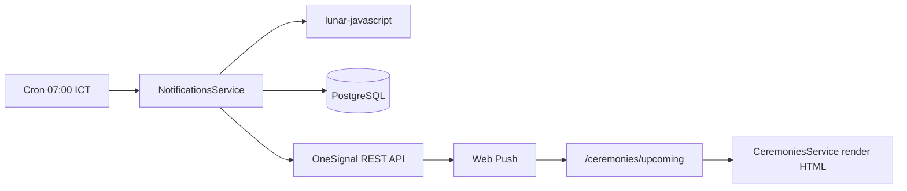

# Kiến trúc hệ thống thông báo ngày giỗ

## Tổng quan

Hệ thống gửi push notification qua **OneSignal** khi sắp đến ngày giỗ (âm lịch) của thành viên đã mất trong tổ chức. Multi-tenant: mỗi `Organization` chỉ gửi cho user thuộc cùng org.



## Thư viện âm lịch

**Chọn: [lunar-javascript](https://github.com/6tail/lunar-javascript)**

| Tiêu chí | lunar-javascript |
|----------|------------------|
| Node.js | Có, zero native deps |
| Âm lịch VN | Hỗ trợ lịch âm dương chuẩn Trung/Việt |
| Document | README + API rõ trên GitHub |
| Bảo trì | Phổ biến, cập nhật thường xuyên |

Thay thế đã xem xét: `vietnamese-lunar-calendar` — ít tài liệu hơn, cộng đồng nhỏ hơn.

Logic: `daysUntilDeathAnniversary()` chuyển ngày âm giỗ sang ngày dương trong năm âm hiện tại, tính chênh lệch solar với hôm nay. Chỉ gửi khi còn 0–3 ngày.

## Database

### User (mở rộng)

- `onesignalSubscriptionId`
- `notificationDeathAnniversaryEnabled` (default `false`)
- `notificationEventEnabled`, `notificationPostEnabled`
- `isActive`

### Person (mở rộng)

- `deathLunarDay`, `deathLunarMonth` — ngày giỗ âm lịch

### NotificationLog

Lưu mọi lần gửi (SENT / FAILED), tránh trùng trong cùng ngày.

## Backend modules

| Module | Route | Mô tả |
|--------|-------|-------|
| `notifications` | `GET/PATCH /notifications/settings` | Cài đặt user |
| | `GET /notifications` | Notification center |
| | `GET /notifications/upcoming` | Ngày giỗ sắp tới |
| | `GET /notifications/stats` | Thống kê admin |
| `ceremonies` | `GET /ceremonies/:personId/html` | Render bài cúng runtime |

Cron: `@Cron(EVERY_DAY_AT_7AM, { timeZone: 'Asia/Ho_Chi_Minh' })`.

## Frontend

| Route | Màn hình |
|-------|----------|
| `/settings/notifications` | Opt-in, toggles, trạng thái quyền trình duyệt |
| `/notifications` | Lịch sử thông báo |
| `/ceremonies/upcoming` | Danh sách giỗ + xem bài cúng |
| Dashboard banner | Opt-in sau login (không hỏi ngay lúc login) |

OneSignal: `lib/services/onesignal.service.ts`, hook `useOneSignal`.

## Bảo mật

- Mọi API đọc person/ceremony kiểm tra `organizationId` qua `assertOrgMemberAccess`.
- Push chỉ gửi user có `notificationDeathAnniversaryEnabled = true` và `onesignalSubscriptionId`.
- Cron lọc theo org của từng Person.

## API payload push

```json
{
  "type": "DEATH_ANNIVERSARY",
  "personId": 123,
  "organizationId": 456
}
```

Click mở: `/ceremonies/upcoming?personId={id}`.

## Tài liệu liên quan

- [ONESIGNAL_SETUP.md](./ONESIGNAL_SETUP.md) — cấu hình OneSignal
- [feature-notification.md](./feature-notification.md) — spec nghiệp vụ
